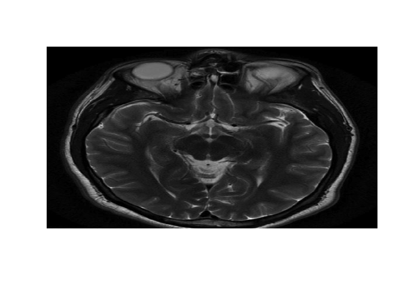
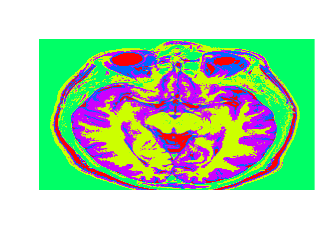
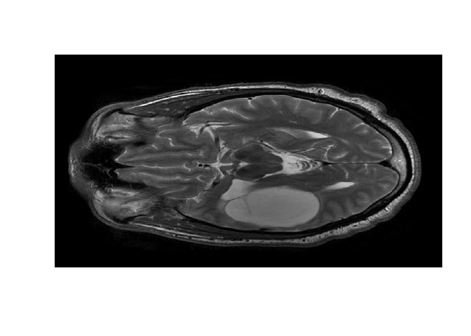
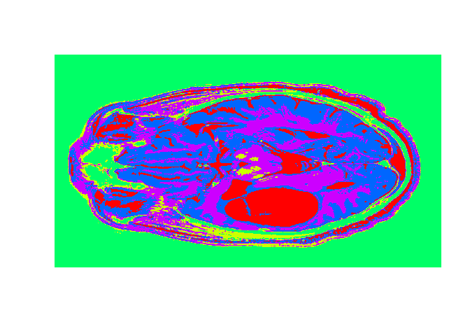

Predicting Tumor (Image segmentation by K-means)
================================================

Reading file
------------

    healthy = read.csv("healthy.csv", header=FALSE)
    healthyMatrix = as.matrix(healthy)
    str(healthyMatrix)

    ##  num [1:566, 1:646] 0.00427 0.00855 0.01282 0.01282 0.01282 ...
    ##  - attr(*, "dimnames")=List of 2
    ##   ..$ : NULL
    ##   ..$ : chr [1:646] "V1" "V2" "V3" "V4" ...

    healthyVector = as.vector(healthyMatrix)

Ploting image
-------------

    image(healthyMatrix,axes=FALSE,col=grey(seq(0,1,length=256)))

\#\# K-means Clustering

    set.seed(1)
    KMC = kmeans(healthyVector, centers = 5, iter.max = 1000)
    str(KMC)

    ## List of 9
    ##  $ cluster     : int [1:365636] 3 3 3 3 3 3 3 3 3 3 ...
    ##  $ centers     : num [1:5, 1] 0.4818 0.1062 0.0196 0.3094 0.1842
    ##   ..- attr(*, "dimnames")=List of 2
    ##   .. ..$ : chr [1:5] "1" "2" "3" "4" ...
    ##   .. ..$ : NULL
    ##  $ totss       : num 5775
    ##  $ withinss    : num [1:5] 96.6 47.2 39.2 57.5 62.3
    ##  $ tot.withinss: num 303
    ##  $ betweenss   : num 5472
    ##  $ size        : int [1:5] 20556 101085 133162 31555 79278
    ##  $ iter        : int 2
    ##  $ ifault      : int 0
    ##  - attr(*, "class")= chr "kmeans"

Extracting clusters
-------------------

    healthyClusters = KMC$cluster
    KMC$centers

    ##         [,1]
    ## 1 0.48177191
    ## 2 0.10619450
    ## 3 0.01961886
    ## 4 0.30942825
    ## 5 0.18420578

Ploting the image with 5 clusters
---------------------------------

    dim(healthyClusters) = c(nrow(healthyMatrix), ncol(healthyMatrix))

    image(healthyClusters, axes = FALSE, col=rainbow(5))

Apply to a test image
---------------------

    tumor = read.csv("tumor.csv", header=FALSE)
    tumorMatrix = as.matrix(tumor)
    tumorVector = as.vector(tumorMatrix)
    image(tumorMatrix,axes=FALSE,col=grey(seq(0,1,length=256)))

Applying clusters from before to new image, using the flexclust package
-----------------------------------------------------------------------

    library(flexclust)

    ## Warning: package 'flexclust' was built under R version 3.4.2

    ## Loading required package: grid

    ## Loading required package: lattice

    ## Loading required package: modeltools

    ## Loading required package: stats4

    KMC.kcca = as.kcca(KMC, healthyVector)
    tumorClusters = predict(KMC.kcca, newdata = tumorVector)

Visualizing the clusters
------------------------

    dim(tumorClusters) = c(nrow(tumorMatrix), ncol(tumorMatrix))

    image(tumorClusters, axes = FALSE, col=rainbow(5))

