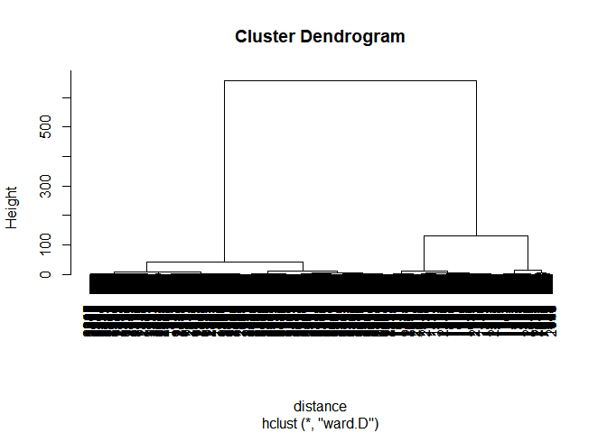

Image Segmentation
================

In computer vision, image segmentation is the process of partitioning a digital image into multiple segments (sets of pixels, also known as super-pixels). The goal of segmentation is to simplify and/or change the representation of an image into something that is more meaningful and easier to analyze. Image segmentation is typically used to locate objects and boundaries (lines, curves, etc.) in images. More precisely, image segmentation is the process of assigning a label to every pixel in an image such that pixels with the same label share certain characteristics.We will use method of clustering for Image segmentation.

Reading csv and some pre-processing
-----------------------------------

``` r
setwd("C:/Users/vinayak/Desktop/FinalmileProject")
flower<-read.csv("flower.csv",header=F)
str(flower)
```

    ## 'data.frame':    50 obs. of  50 variables:
    ##  $ V1 : num  0.0991 0.0991 0.1034 0.1034 0.1034 ...
    ##  $ V2 : num  0.112 0.108 0.112 0.116 0.108 ...
    ##  $ V3 : num  0.134 0.116 0.121 0.116 0.112 ...
    ##  $ V4 : num  0.138 0.138 0.121 0.121 0.112 ...
    ##  $ V5 : num  0.138 0.134 0.125 0.116 0.112 ...
    ##  $ V6 : num  0.138 0.129 0.121 0.108 0.112 ...
    ##  $ V7 : num  0.129 0.116 0.103 0.108 0.112 ...
    ##  $ V8 : num  0.116 0.103 0.103 0.103 0.116 ...
    ##  $ V9 : num  0.1121 0.0991 0.1078 0.1121 0.1164 ...
    ##  $ V10: num  0.121 0.108 0.112 0.116 0.125 ...
    ##  $ V11: num  0.134 0.125 0.129 0.134 0.129 ...
    ##  $ V12: num  0.147 0.134 0.138 0.129 0.138 ...
    ##  $ V13: num  0.000862 0.146552 0.142241 0.142241 0.133621 ...
    ##  $ V14: num  0.000862 0.000862 0.142241 0.133621 0.12931 ...
    ##  $ V15: num  0.142 0.142 0.134 0.121 0.116 ...
    ##  $ V16: num  0.125 0.125 0.116 0.108 0.108 ...
    ##  $ V17: num  0.1121 0.1164 0.1078 0.0991 0.0991 ...
    ##  $ V18: num  0.108 0.112 0.108 0.108 0.108 ...
    ##  $ V19: num  0.121 0.129 0.125 0.116 0.116 ...
    ##  $ V20: num  0.138 0.129 0.125 0.116 0.116 ...
    ##  $ V21: num  0.138 0.134 0.121 0.125 0.125 ...
    ##  $ V22: num  0.134 0.129 0.125 0.121 0.103 ...
    ##  $ V23: num  0.125 0.1207 0.1164 0.1164 0.0819 ...
    ##  $ V24: num  0.1034 0.1034 0.0991 0.0991 0.1034 ...
    ##  $ V25: num  0.0948 0.0905 0.0905 0.1034 0.125 ...
    ##  $ V26: num  0.0862 0.0862 0.0991 0.125 0.1422 ...
    ##  $ V27: num  0.086207 0.086207 0.103448 0.12931 0.000862 ...
    ##  $ V28: num  0.0991 0.1078 0.1164 0.1293 0.1466 ...
    ##  $ V29: num  0.116 0.134 0.134 0.121 0.142 ...
    ##  $ V30: num  0.121 0.138 0.142 0.129 0.138 ...
    ##  $ V31: num  0.121 0.134 0.142 0.134 0.129 ...
    ##  $ V32: num  0.116 0.134 0.129 0.116 0.112 ...
    ##  $ V33: num  0.108 0.112 0.116 0.108 0.108 ...
    ##  $ V34: num  0.1078 0.1078 0.1034 0.0991 0.1034 ...
    ##  $ V35: num  0.1078 0.1034 0.0991 0.0991 0.0991 ...
    ##  $ V36: num  0.1078 0.1034 0.1034 0.0905 0.0862 ...
    ##  $ V37: num  0.1078 0.1078 0.1034 0.0819 0.0733 ...
    ##  $ V38: num  0.0948 0.0991 0.0776 0.069 0.0733 ...
    ##  $ V39: num  0.0733 0.056 0.0474 0.0474 0.056 ...
    ##  $ V40: num  0.0474 0.0388 0.0431 0.0474 0.0603 ...
    ##  $ V41: num  0.0345 0.0345 0.0388 0.0474 0.0647 ...
    ##  $ V42: num  0.0259 0.0259 0.0345 0.0431 0.056 ...
    ##  $ V43: num  0.0259 0.0259 0.0388 0.0517 0.0603 ...
    ##  $ V44: num  0.0302 0.0302 0.0345 0.0517 0.0603 ...
    ##  $ V45: num  0.0259 0.0259 0.0259 0.0388 0.0474 ...
    ##  $ V46: num  0.0259 0.0172 0.0172 0.0259 0.0345 ...
    ##  $ V47: num  0.01724 0.01724 0.00862 0.02155 0.02586 ...
    ##  $ V48: num  0.0216 0.0129 0.0129 0.0172 0.0302 ...
    ##  $ V49: num  0.0216 0.0216 0.0216 0.0345 0.0603 ...
    ##  $ V50: num  0.0302 0.0345 0.0388 0.0603 0.0776 ...

``` r
flowerMatrix<-as.matrix(flower)
flowerVector<-as.vector(flowerMatrix)
str(flowerVector)
```

    ##  num [1:2500] 0.0991 0.0991 0.1034 0.1034 0.1034 ...

Orignal Image
-------------

``` r
image(flowerMatrix,axes=F)
```


Hierarrchial Clustering
-----------------------

### Calculating distance between data points

``` r
distance<-dist(flowerVector,method="euclidean")
distance[[1]]
```

    ## [1] 0

### Applying model

``` r
clusterIntensity = hclust(distance, method="ward")
```

    ## The "ward" method has been renamed to "ward.D"; note new "ward.D2"

``` r
plot(clusterIntensity)
```



It seems taking two or three clusters are reasonoable.
Going with three
``` r
#plot1<-rect.hclust(clusterIntensity, k = 3, border = "red")
flowerClusters = cutree(clusterIntensity, k = 3)
flowerClusters
```

    ##    [1] 1 1 1 1 1 1 1 1 1 1 1 1 1 1 1 1 1 1 1 1 1 1 1 1 1 1 1 1 1 1 1 1 1 1
    ##   [35] 1 1 1 1 1 1 1 1 1 1 1 1 1 1 1 1 1 1 1 1 1 1 1 1 1 1 1 1 1 1 1 1 1 1
    ##   [69] 1 1 1 1 1 1 1 1 1 1 1 1 1 1 1 1 1 1 1 1 1 1 1 1 1 1 1 1 1 1 1 1 1 1
    ##  [103] 1 1 1 1 1 1 1 1 1 1 1 1 1 1 1 1 1 1 1 1 1 1 1 1 1 1 1 1 1 1 1 1 1 1
    ##  [137] 1 1 1 1 1 1 1 1 1 1 1 1 1 1 1 1 1 1 1 1 1 1 1 1 1 1 1 1 1 1 1 1 1 1
    ##  [171] 1 1 1 1 1 1 1 1 1 1 1 1 1 1 1 1 1 1 1 1 1 1 1 1 1 1 1 1 1 1 1 1 1 1
    ##  [205] 1 1 1 1 1 1 1 1 1 1 1 1 1 1 1 1 1 1 1 1 1 1 1 1 1 1 1 1 1 1 1 1 1 1
    ##  [239] 1 1 1 1 1 1 1 1 1 1 1 1 1 1 1 1 1 1 1 1 1 1 1 1 1 1 1 1 1 1 1 1 1 1
    ##  [273] 1 1 1 1 1 1 1 1 1 1 1 1 1 1 1 1 1 1 1 1 1 1 1 1 1 1 1 1 1 1 1 1 1 1
    ##  [307] 1 1 1 1 1 1 1 1 1 1 1 1 1 1 1 1 2 2 1 1 1 1 1 1 1 1 1 1 1 1 1 1 1 1
    ##  [341] 1 1 1 1 1 1 1 1 1 1 1 1 1 1 1 1 1 1 1 1 1 1 1 1 1 1 1 1 1 1 1 1 3 3
    ##  [375] 2 2 3 2 1 1 1 1 1 1 1 1 1 1 1 1 1 1 1 1 1 1 1 1 1 1 1 1 1 1 1 1 1 1
    ##  [409] 1 1 1 1 1 1 1 1 1 2 2 1 1 1 3 3 3 3 3 2 1 2 3 2 1 1 1 1 1 1 1 1 1 1
    ##  [443] 1 1 1 1 1 1 1 1 1 1 1 1 1 1 1 1 1 1 1 1 1 1 1 1 1 3 3 1 1 1 3 3 3 3
    ##  [477] 3 2 2 3 3 1 1 1 1 1 1 1 1 1 1 1 1 1 1 1 1 1 1 1 1 1 1 1 1 1 1 1 1 1
    ##  [511] 1 1 1 1 1 1 2 3 3 2 1 1 3 3 3 3 3 2 3 3 3 1 2 3 3 1 1 1 1 1 1 1 1 1
    ##  [545] 1 1 1 1 1 1 1 1 1 1 1 1 1 1 1 1 1 1 2 3 2 1 2 3 3 3 1 1 3 3 3 3 3 2
    ##  [579] 3 3 2 2 3 3 2 2 2 2 1 1 1 1 1 1 1 1 1 1 1 1 1 1 1 1 1 1 1 1 1 1 1 1
    ##  [613] 2 3 3 2 1 3 3 3 2 1 2 3 3 3 3 3 3 3 2 3 3 3 3 3 3 3 1 1 1 1 1 1 1 1
    ##  [647] 1 1 1 1 1 1 1 1 1 1 1 1 1 1 1 1 1 3 3 3 2 2 3 3 3 1 2 3 3 3 3 3 3 3
    ##  [681] 3 3 3 3 3 3 3 2 1 1 1 1 1 1 1 1 1 1 1 1 1 1 1 1 1 1 1 1 1 1 1 1 1 2
    ##  [715] 3 3 3 3 3 3 3 2 1 3 3 3 3 3 3 3 3 3 3 3 3 3 3 2 1 1 1 1 1 1 1 1 1 1
    ##  [749] 1 1 1 1 1 1 1 1 1 1 1 2 3 2 1 1 2 3 3 3 3 3 3 3 2 3 3 3 3 3 3 3 3 3
    ##  [783] 3 3 3 3 2 1 1 1 1 1 1 1 1 1 1 1 1 1 1 1 1 1 1 1 1 1 1 3 3 3 3 2 1 1
    ##  [817] 3 3 3 3 3 3 2 2 3 3 3 3 3 3 3 3 3 3 3 2 1 1 2 2 3 3 1 1 1 1 1 1 1 1
    ##  [851] 1 1 1 1 1 1 1 1 1 1 2 3 3 3 2 1 2 3 3 3 3 3 3 2 3 3 3 3 3 3 3 3 3 3
    ##  [885] 2 1 2 3 3 3 3 3 1 1 1 1 1 1 1 1 1 1 1 1 1 1 1 1 1 1 1 2 3 3 3 3 2 2
    ##  [919] 3 3 3 3 3 2 2 3 3 3 3 3 3 3 3 2 1 3 3 3 3 3 3 2 1 1 1 1 1 1 1 1 1 1
    ##  [953] 1 1 1 1 1 1 2 2 3 3 3 3 3 3 3 3 3 3 3 3 3 2 2 2 2 2 3 3 3 3 2 2 3 3
    ##  [987] 3 3 3 3 2 1 1 1 1 1 1 1 1 1 1 1 1 1 1 1 1 1 1 1 2 3 3 3 3 3 3 3 3 3
    ## [1021] 3 2 2 2 2 2 2 2 2 3 3 3 3 3 3 3 3 2 2 1 1 1 1 1 1 1 1 1 1 1 1 1 1 1
    ## [1055] 1 1 2 2 2 3 3 3 3 3 3 3 3 3 3 2 2 2 2 2 2 2 2 2 2 2 3 3 3 3 3 3 2 2
    ## [1089] 2 2 3 3 3 2 1 1 1 1 1 1 1 1 1 1 1 2 3 3 3 3 3 3 3 3 3 3 3 3 3 2 2 2
    ## [1123] 2 2 2 2 2 2 2 2 3 3 3 3 3 3 3 3 3 3 3 3 3 2 1 1 1 1 1 1 1 1 1 1 1 1
    ## [1157] 2 3 3 3 3 3 3 3 3 3 3 3 3 2 2 2 2 2 2 2 2 2 2 2 2 3 3 3 3 3 3 3 3 2
    ## [1191] 2 1 1 1 1 1 1 1 1 1 1 1 1 1 1 1 1 1 1 1 2 2 2 3 3 3 3 3 2 2 2 2 2 2
    ## [1225] 2 2 2 2 2 2 2 3 3 3 2 2 2 1 1 1 1 1 1 1 1 1 1 1 1 1 1 1 1 1 1 1 1 1
    ## [1259] 3 3 3 3 3 3 3 3 3 3 3 2 2 2 2 2 2 2 2 2 2 2 2 2 2 2 2 2 1 1 1 1 1 1
    ## [1293] 1 1 1 1 1 1 1 1 1 1 1 1 1 1 1 2 3 3 3 3 3 3 3 3 3 3 3 2 2 2 2 2 2 2
    ## [1327] 2 2 2 2 3 3 3 3 3 3 3 3 3 2 2 2 1 1 1 1 1 1 1 1 1 1 1 1 1 1 1 3 3 3
    ## [1361] 3 3 3 3 3 3 3 3 3 3 2 2 2 2 2 2 2 2 2 2 3 3 3 3 3 3 3 3 3 3 3 3 3 1
    ## [1395] 1 1 1 1 1 1 1 1 1 1 1 1 1 2 3 3 3 3 3 3 3 3 3 3 3 3 2 2 2 2 2 2 2 2
    ## [1429] 2 2 3 3 3 3 3 3 3 3 3 3 3 3 3 1 1 1 1 1 1 1 1 1 1 1 1 1 1 1 3 3 3 3
    ## [1463] 3 3 3 3 3 3 3 3 3 3 3 2 2 2 2 2 2 3 3 3 3 3 3 3 3 3 3 3 2 1 1 1 1 1
    ## [1497] 1 1 1 1 1 1 1 1 1 1 1 1 3 3 3 3 3 3 3 2 3 3 3 3 3 3 3 2 2 3 3 3 2 3
    ## [1531] 3 3 3 3 3 2 3 3 3 3 3 2 1 1 1 1 1 1 1 1 1 1 1 1 1 1 1 1 2 3 3 2 2 1
    ## [1565] 2 3 3 3 3 3 3 3 3 2 2 3 3 3 3 2 3 3 3 3 3 2 1 2 2 2 2 2 1 1 1 1 1 1
    ## [1599] 1 1 1 1 1 1 1 1 1 1 1 1 1 1 1 2 3 3 3 3 3 3 3 3 3 2 3 3 3 3 3 2 3 3
    ## [1633] 3 3 3 3 3 1 1 1 1 1 1 1 1 1 1 1 1 1 1 1 1 1 1 1 1 1 1 1 1 1 2 3 3 3
    ## [1667] 2 3 3 3 3 3 2 2 3 3 3 3 3 2 1 3 3 3 3 3 3 3 2 1 1 1 1 1 1 1 1 1 1 1
    ## [1701] 1 1 1 1 1 1 1 1 1 1 1 2 3 3 2 2 3 3 3 3 3 3 1 3 3 3 3 3 3 2 1 2 3 3
    ## [1735] 3 3 3 3 3 2 1 1 1 1 1 1 1 1 1 1 1 1 1 1 1 1 1 1 1 1 1 3 3 2 1 3 3 3
    ## [1769] 3 3 3 1 1 3 3 3 3 3 3 2 1 1 2 3 3 3 3 2 3 2 1 1 1 1 1 1 1 1 1 1 1 1
    ## [1803] 1 1 1 1 1 1 1 1 1 2 2 1 2 3 3 3 3 3 2 1 2 3 3 2 3 3 3 2 1 1 1 1 3 3
    ## [1837] 3 2 1 1 1 1 1 1 1 1 1 1 1 1 1 1 1 1 1 1 1 1 1 1 1 1 1 1 3 3 3 3 3 3
    ## [1871] 1 1 2 3 3 2 3 3 3 3 1 1 1 1 1 2 2 2 1 1 1 1 1 1 1 1 1 1 1 1 1 1 1 1
    ## [1905] 1 1 1 1 1 1 1 1 1 1 2 3 3 3 3 3 1 1 2 3 3 1 3 3 3 3 1 1 1 1 1 1 1 1
    ## [1939] 1 1 1 1 1 1 1 1 1 1 1 1 1 1 1 1 1 1 1 1 1 1 1 1 1 1 1 2 2 3 3 2 1 1
    ## [1973] 2 3 3 1 2 3 3 3 1 1 1 1 1 1 1 1 1 1 1 1 1 1 1 1 1 1 1 1 1 1 1 1 1 1
    ## [2007] 1 1 1 1 1 1 1 1 1 1 1 2 3 1 1 1 1 3 3 1 1 3 3 3 1 1 1 1 1 1 1 1 1 1
    ## [2041] 1 1 1 1 1 1 1 1 1 1 1 1 1 1 1 1 1 1 1 1 1 1 1 1 1 1 1 1 1 1 1 1 1 2
    ## [2075] 3 1 1 1 2 2 1 1 1 1 1 1 1 1 1 1 1 1 1 1 1 1 1 1 1 1 1 1 1 1 1 1 1 1
    ## [2109] 1 1 1 1 1 1 1 1 1 1 1 1 1 1 1 1 1 1 1 1 1 1 1 1 1 1 1 1 1 1 1 1 1 1
    ## [2143] 1 1 1 1 1 1 1 1 1 1 1 1 1 1 1 1 1 1 1 1 1 1 1 1 1 1 1 1 1 1 1 1 1 1
    ## [2177] 1 1 1 1 1 1 1 1 1 1 1 1 1 1 1 1 1 1 1 1 1 1 1 1 1 1 1 1 1 1 1 1 1 1
    ## [2211] 1 1 1 1 1 1 1 1 1 1 1 1 1 1 1 1 1 1 1 1 1 1 1 1 1 1 1 1 1 1 1 1 1 1
    ## [2245] 1 1 1 1 1 1 1 1 1 1 1 1 1 1 1 1 1 1 1 1 1 1 1 1 1 1 1 1 1 1 1 1 1 1
    ## [2279] 1 1 1 1 1 1 1 1 1 1 1 1 1 1 1 1 1 1 1 1 1 1 1 1 1 1 1 1 1 1 1 1 1 1
    ## [2313] 1 1 1 1 1 1 1 1 1 1 1 1 1 1 1 1 1 1 1 1 1 1 1 1 1 1 1 1 1 1 1 1 1 1
    ## [2347] 1 1 1 1 1 1 1 1 1 1 1 1 1 1 1 1 1 1 1 1 1 1 1 1 1 1 1 1 1 1 1 1 1 1
    ## [2381] 1 1 1 1 1 1 1 1 1 1 1 1 1 1 1 1 1 1 1 1 1 1 1 1 1 1 1 1 1 1 1 1 1 1
    ## [2415] 1 1 1 1 1 1 1 1 1 1 1 1 1 1 1 1 1 1 1 1 1 1 1 1 1 1 1 1 1 1 1 1 1 1
    ## [2449] 1 1 1 1 1 1 1 1 1 1 1 1 1 1 1 1 1 1 1 1 1 1 1 1 1 1 1 1 1 1 1 1 1 1
    ## [2483] 1 1 1 1 1 1 1 1 1 1 1 1 1 1 1 1 1 1

Analysis of different clusters
==============================

``` r
tapply(flowerVector, flowerClusters, mean)
```

    ##          1          2          3 
    ## 0.08574315 0.50826255 0.93147713

``` r
tapply(flowerVector,flowerClusters,summary)
```

    ## $`1`
    ##    Min. 1st Qu.  Median    Mean 3rd Qu.    Max. 
    ## 0.00000 0.04741 0.08707 0.08574 0.12069 0.26810 
    ## 
    ## $`2`
    ##    Min. 1st Qu.  Median    Mean 3rd Qu.    Max. 
    ##  0.2810  0.4481  0.5440  0.5083  0.5709  0.6474 
    ## 
    ## $`3`
    ##    Min. 1st Qu.  Median    Mean 3rd Qu.    Max. 
    ##  0.8017  0.9267  0.9397  0.9315  0.9569  1.0000

Giving the final segmented Image
================================

``` r
dim(flowerClusters) = c(50,50)
image(flowerClusters, axes = FALSE)
```


